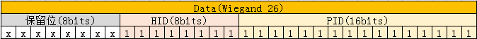

# Android Wiegand
This is a project that enables Android to support Wiegand interface, including Wiegand driver and Framework APIs, supports Wiegand read and write, and supports Wiegand 26 and 34 protocols.

## Usage
1. Copy wiegand to kernel/drivers/misc/ directory.
2. Modify the kernel/drivers/misc/Kconfig as follows:
```
source "drivers/misc/wiegand/Kconfig"
```
3. Modify the kernel/drivers/misc/Makefile as follows:
```
obj-$(CONFIG_WIEGAND_DRIVER) += wiegand/
```
4. Modify the dts as follows:
```
/ {  
	wiegandin: wiegandin { 
		status = "okay";
		compatible = "wiegandin";

		wiegand,data0 = <&gpio5 RK_PB7 IRQ_TYPE_LEVEL_HIGH>;
		wiegand,data1 = <&gpio5 RK_PB6 IRQ_TYPE_LEVEL_HIGH>;

		wiegand,data_length = <26>;
		wiegand,pulse_width = <500>; // 500 us
		wiegand,pulse_intval = <1850>; // 1850 us
	};

	wiegandout: wiegandout {
		status = "okay";
		compatible = "wiegandout";

		wiegand,data0 = <&gpio5 RK_PB7 IRQ_TYPE_LEVEL_HIGH>;
		wiegand,data1 = <&gpio5 RK_PB6 IRQ_TYPE_LEVEL_HIGH>;

		wiegand,data_length = <26>;
		wiegand,pulse_width = <500>; // 500 us
		wiegand,pulse_intval = <1850>; // 1850 us
	};
};
```
5. Merge wiegand.patch.

## API
1. Create directory like aidl/android/os/ in the APP source code src/main directory.
2. Create IWiegandService.aidl file in the aidl/android/os/ directory, the content is as follows:  
```Java
	package android.os;
	
	/** {@hide} */
	interface IWiegandService
	{
		int setReadFormat(int format);
		int setWriteFormat(int format);
		int read();
		int write(int data);
	}
```
3. Call the API as follows:  
```Java
	private IWiegandService mWiegandService;
	
	// Get WiegandService
	try {
	    method = Class.forName("android.os.ServiceManager").getMethod("getService", String.class);
	    IBinder binder = (IBinder) method.invoke(null, new Object[]{"wiegand"});
	    mWiegandService = IWiegandService.Stub.asInterface(binder);
	} catch (Exception e) {
	    e.printStackTrace();
	}
	
	// Wiegand protocol
	public enum WiegandFormat {
	    WIEGAND_FORMAT_26,
	    WIEGAND_FORMAT_34
	};
	
	/**
	 * Set the wiegand read format
	 *
	 * @param format wiegand format
	 *               WiegandFormat.WIEGAND_FORMAT_26：wiegand 26
	 *               WiegandFormat.WIEGAND_FORMAT_24：wiegand 34
	 * @return true：success，false：fail
	 */
	@Override
	public boolean setWiegandReadFormat(WiegandFormat format) {
	    if (mWiegandService != null) {
	        try {
	            int ret = -1;
	            if (format == WiegandFormat.WIEGAND_FORMAT_26) {
	                ret = mWiegandService.setReadFormat(26);
	            } else if (format == WiegandFormat.WIEGAND_FORMAT_34) {
	                ret = mWiegandService.setReadFormat(34);
	            }
	            if (ret < 0) {
	                Log.e(TAG, "setWiegandReadFormat, error: " + ret);
	            } else {
	                return true;
	            }
	        } catch (RemoteException e) {
	            Log.e(TAG, "setWiegandReadFormat, " + e.getMessage());
	        }
	    }
	    return false;
	}
	
	/**
	 * Set the wiegand write format
	 *
	 * @param format wiegand format
	 *               WiegandFormat.WIEGAND_FORMAT_26：wiegand 26
	 *               WiegandFormat.WIEGAND_FORMAT_24：wiegand 34
	 * @return true：success，false：fail
	 */
	@Override
	public boolean setWiegandWriteFormat(WiegandFormat format) {
	    if (mWiegandService != null) {
	        try {
	            int ret = -1;
	            if (format == WiegandFormat.WIEGAND_FORMAT_26) {
	                ret = mWiegandService.setWriteFormat(26);
	            } else if (format == WiegandFormat.WIEGAND_FORMAT_34) {
	                ret = mWiegandService.setWriteFormat(34);
	            }
	            if (ret < 0) {
	                Log.e(TAG, "setWiegandWriteFormat, error: " + ret);
	            } else {
	                return true;
	            }
	        } catch (RemoteException e) {
	            Log.e(TAG, "setWiegandWriteFormat, " + e.getMessage());
	        }
	    }
	    return false;
	}
	
	/**
	 * Wiegand read
	 *
	 * @return Wiegand data（<0：fail）
	 */
	@Override
	public int wiegandRead() {
	    if (mWiegandService != null) {
	        try {
	            return mWiegandService.read();
	        } catch (RemoteException e) {
	            Log.e(TAG, "wiegandRead, " + e.getMessage());
	        }
	    }
	    return -1;
	}
	
	/**
	 * Wiegand write
	 *
	 * @param data Wiegand data
	 * @return true：success，false：fail
	 */
	@Override
	public boolean wiegandWrite(int data) {
	    if (mWiegandService != null) {
	        try {
	            int ret = mWiegandService.write(data);
	            if (ret < 0) {
	                Log.e(TAG, "wiegandWrite, error: " + ret);
	            } else {
	                return true;
	            }
	        } catch (RemoteException e) {
	            Log.e(TAG, "wiegandWrite, " + e.getMessage());
	        }
	    }
	    return false;
	}
```

## Data Format
### Wiegand 26
A total of 26bits of data, remove the 2bits parity bit, the remaining 24bits data bits, take the low 24bits data of the int type data.  



### Wiegand 34
A total of 34 bits of data, after removing the 2 bits of parity, the remaining 32 bits of data, which corresponds to a complete int data.  


## Developed By
* ayst.shen@foxmail.com

## License
	Copyright 2019 Bob Shen.

	Licensed under the Apache License, Version 2.0 (the "License");
	you may not use this file except in compliance with the License.
	You may obtain a copy of the License at

	http://www.apache.org/licenses/LICENSE-2.0

	Unless required by applicable law or agreed to in writing, software
	distributed under the License is distributed on an "AS IS" BASIS,
	WITHOUT WARRANTIES OR CONDITIONS OF ANY KIND, either express or implied.
	See the License for the specific language governing permissions and
	limitations under the License.
